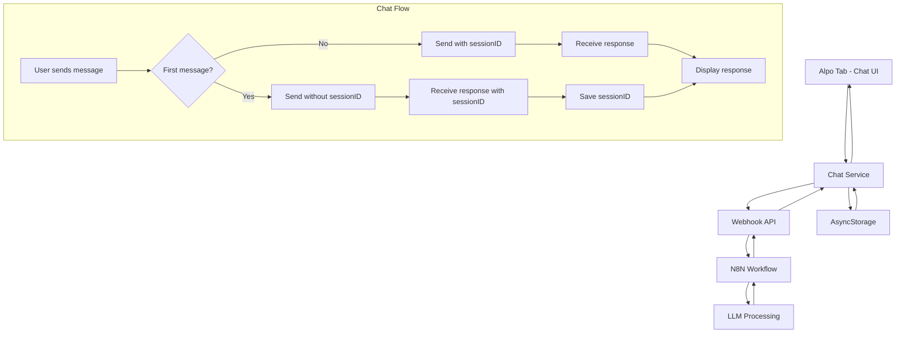

# Chat UI Implementation Plan for Alpo Tab

## Overview
This plan outlines the implementation of a chat interface in the Alpo tab that connects to an N8N webhook backend. The chat will maintain session continuity through unique session IDs and provide a seamless user experience.

## Architecture Overview



## Detailed Implementation Steps

### Phase 1: Clear Existing Content and Setup
**Estimated Time: 30 minutes**

#### Step 1.1: Clear AlpoScreen Content
- Remove all existing content from [`AlpoScreen.tsx`](AlpoApp/src/screens/AlpoScreen.tsx:1)
- Keep only the basic component structure and theme context
- Maintain the user prop interface for future use

#### Step 1.2: Install Required Dependencies
- Add HTTP client library (axios or fetch - using built-in fetch)
- Add UUID generation library for potential client-side ID generation
- Add any additional UI components needed for chat interface

### Phase 2: Create Chat Service Layer
**Estimated Time: 45 minutes**

#### Step 2.1: Create Chat Service
- Create [`src/services/chatService.ts`](AlpoApp/src/services/chatService.ts:1)
- Implement webhook communication logic
- Handle request/response formatting
- Manage session ID persistence

#### Step 2.2: Define Chat Types
- Create TypeScript interfaces for:
  - Chat message structure
  - Webhook request/response formats
  - Chat session data

#### Step 2.3: Implement Session Management
- Store session ID in AsyncStorage
- Handle session persistence across app restarts
- Implement session cleanup if needed

### Phase 3: Build Chat UI Components
**Estimated Time: 90 minutes**

#### Step 3.1: Create Message Components
- Create [`src/components/ChatMessage.tsx`](AlpoApp/src/components/ChatMessage.tsx:1) for individual messages
- Support user and agent message types
- Implement proper styling with theme support

#### Step 3.2: Create Chat Input Component
- Create [`src/components/ChatInput.tsx`](AlpoApp/src/components/ChatInput.tsx:1)
- Handle text input and send functionality
- Add loading states and send button

#### Step 3.3: Create Chat Container Component
- Create [`src/components/ChatContainer.tsx`](AlpoApp/src/components/ChatContainer.tsx:1)
- Manage message list and scrolling
- Handle message state management

### Phase 4: Integrate Chat into AlpoScreen
**Estimated Time: 60 minutes**

#### Step 4.1: Implement Chat State Management
- Add React hooks for managing chat state
- Implement message sending logic
- Handle loading and error states

#### Step 4.2: Connect Chat Service
- Integrate chat service with UI components
- Implement proper error handling
- Add retry logic for failed requests

#### Step 4.3: Style Chat Interface
- Apply consistent styling with app theme
- Ensure dark mode compatibility
- Implement responsive design

### Phase 5: Session Management Implementation
**Estimated Time: 45 minutes**

#### Step 5.1: Implement Session ID Handling
- Handle first message without session ID
- Save session ID from first response
- Include session ID in subsequent messages

#### Step 5.2: Add Session Persistence
- Store session data in AsyncStorage
- Load existing session on app start
- Handle session expiration if applicable

### Phase 6: Testing and Polish
**Estimated Time: 60 minutes**

#### Step 6.1: Error Handling
- Add comprehensive error handling
- Implement user-friendly error messages
- Add network connectivity checks

#### Step 6.2: UI Polish
- Add loading indicators
- Implement smooth animations
- Add message timestamps if needed

#### Step 6.3: Testing
- Test first message flow
- Test session continuity
- Test error scenarios
- Test theme switching

## Technical Specifications

### Webhook Integration Details
- **URL**: `https://n8n.andsome.fi/webhook/c389f93f-25da-42d1-929a-17046d85c5ad`
- **Method**: POST
- **Content-Type**: application/json

### Request Format
```typescript
// First message
{
  "message": "user message text"
}

// Subsequent messages
{
  "message": "user message text",
  "sessionID": "unique-session-id-from-first-response"
}
```

### Response Format
```typescript
{
  "agentMessage": "AI response text",
  "sessionID": "unique-session-id"
}
```

### File Structure
```
AlpoApp/src/
├── components/
│   ├── ChatContainer.tsx      # Main chat container
│   ├── ChatMessage.tsx        # Individual message component
│   └── ChatInput.tsx          # Message input component
├── services/
│   └── chatService.ts         # Webhook communication service
├── screens/
│   └── AlpoScreen.tsx         # Updated with chat UI
└── types/
    └── chat.ts                # Chat-related TypeScript types
```

### State Management Strategy
- Use React hooks (useState, useEffect) for local chat state
- AsyncStorage for session persistence
- Context API if chat needs to be accessed from other screens

### Error Handling Strategy
- Network errors: Show retry option
- Webhook errors: Display user-friendly messages
- Session errors: Allow session reset
- Input validation: Prevent empty messages

## Dependencies to Add
```json
{
  "react-native-uuid": "^2.0.1"  // For generating client-side IDs if needed
}
```

## Success Criteria
1. ✅ Alpo tab content completely cleared
2. ✅ Chat UI displays properly in light and dark themes
3. ✅ First message sent without sessionID
4. ✅ SessionID received and stored from first response
5. ✅ Subsequent messages include sessionID
6. ✅ Messages display correctly (user vs agent)
7. ✅ Session persists across app restarts
8. ✅ Proper error handling for network issues
9. ✅ Loading states during message sending
10. ✅ Smooth scrolling and user experience

## Risk Mitigation
- **Network Issues**: Implement retry logic and offline detection
- **Session Loss**: Add session reset functionality
- **UI Performance**: Implement message virtualization for long conversations
- **Memory Management**: Limit stored message history

## Implementation Notes
- The current [`AlpoScreen.tsx`](AlpoApp/src/screens/AlpoScreen.tsx:1) contains welcome content that needs to be completely replaced
- The app uses [`ThemeContext`](AlpoApp/src/context/ThemeContext.tsx:1) for dark mode support - ensure chat components integrate properly
- User authentication is handled via [`auth.ts`](AlpoApp/src/services/auth.ts:1) and user data is available in the AlpoScreen component
- The app uses React Navigation with bottom tabs configured in [`TabNavigator.tsx`](AlpoApp/src/navigation/TabNavigator.tsx:1)

This plan provides a comprehensive roadmap for implementing the chat functionality while maintaining code quality and user experience standards. Each phase builds upon the previous one, allowing for iterative development and testing.