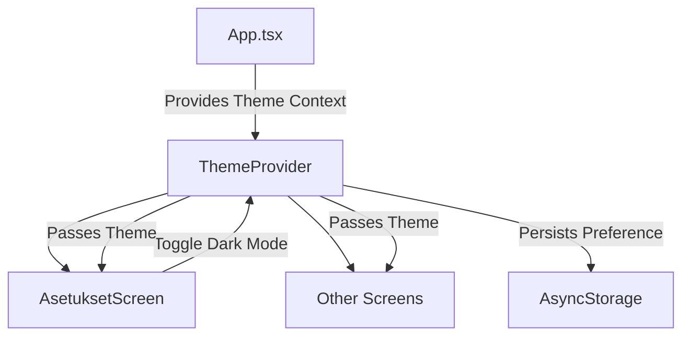

# Plan to Diagnose Why Dark Mode Is Not Working in AlpoApp/src/screens/AsetuksetScreen.tsx

## Overview
The dark mode toggle in `AsetuksetScreen.tsx` is implemented as a local state (`darkMode`) controlled by a Switch component. However, this state is not connected to any global theme context or provider, nor does it affect the styles in the screen or elsewhere in the app. The app does not appear to have any global theming or dark mode management system in place.

## Steps to Diagnose and Fix

### 1. Verify Dark Mode State Scope
- Confirm that the `darkMode` state in `AsetuksetScreen.tsx` is local and not shared or persisted.
- Check if the dark mode state is passed to any parent component or global store (currently it is not).

### 2. Check for Global Theme or Context
- The app entry point (`App.tsx`) and navigation (`TabNavigator.tsx`) do not implement or provide any theme or dark mode context.
- No theme-related files or context providers were found in the codebase.
- This means dark mode is not managed globally.

### 3. Review Styling Approach
- Styles in `AsetuksetScreen.tsx` are static and do not change based on the `darkMode` state.
- The container background color and text colors are hardcoded for light mode.
- No dynamic styling or conditional styles are applied based on dark mode.

### 4. Investigate Dark Mode Persistence
- The dark mode state is not persisted in AsyncStorage or any other storage.
- It resets on every screen mount.

### 5. Suggest Implementation for Dark Mode Support
- Introduce a global theme context or use a theming library (e.g., React Navigation's theming, React Native Paper, or styled-components).
- Lift the dark mode state to a global provider or the app root (`App.tsx`).
- Pass the dark mode state and toggle function down via context or props.
- Update styles dynamically based on the current theme (dark or light).
- Persist the dark mode preference in AsyncStorage or similar for persistence across app restarts.
- Update components and navigation to consume the theme and apply appropriate styles.

## Mermaid Diagram of Proposed Dark Mode Flow

## Summary
Currently, the dark mode toggle in `AsetuksetScreen.tsx` only changes local state without affecting the app's appearance. To fix this, a global theme management system is needed, with dynamic styling and persistence of the dark mode preference.