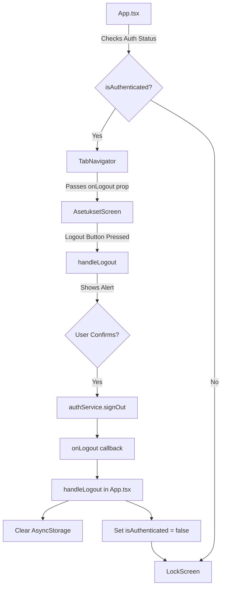

# Logout Error Analysis and Fix Plan

## Problem Description
When the 'Logout' button is pressed in `AsetuksetScreen.tsx`, nothing happens. The user remains logged in and the app doesn't navigate back to the login screen.

## Current Implementation Analysis

### 1. Authentication Flow Overview



### 2. Key Components

#### App.tsx (Lines 76-80)
```typescript
const handleLogout = async () => {
  await AsyncStorage.removeItem('user');
  setUser(null);
  setIsAuthenticated(false);
};
```

#### AsetuksetScreen.tsx (Lines 16-35)
```typescript
const handleLogout = async () => {
  Alert.alert(
    'Logout',
    'Are you sure you want to logout?',
    [
      {
        text: 'Cancel',
        style: 'cancel',
      },
      {
        text: 'Logout',
        style: 'destructive',
        onPress: async () => {
          await authService.signOut();
          onLogout();
        },
      },
    ],
  );
};
```

#### auth.ts (Lines 64-70)
```typescript
async signOut() {
  if (USE_MOCK_AUTH || !supabase) {
    return mockAuthService.signOut();
  }
  const { error } = await supabase.auth.signOut();
  return { error };
}
```

## Root Cause Analysis

The logout functionality appears to be correctly implemented from a code perspective. The issue is likely one of the following:

### 1. **Error Handling Gap**
The `authService.signOut()` might be throwing an error that's not being caught, causing the logout flow to stop before `onLogout()` is called.

### 2. **Mock Auth Service Issue**
If the app is using mock authentication (`USE_MOCK_AUTH = true`), the `mockAuthService.signOut()` implementation might not be working correctly.

### 3. **Async/Await Race Condition**
There might be a timing issue where the auth service sign out completes but the state update doesn't trigger a re-render.

### 4. **Alert Dialog Issue**
The Alert dialog's onPress handler might not be executing properly on certain platforms or React Native versions.

## Detailed Fix Plan

### Step 1: Add Error Handling and Logging
Add comprehensive error handling to identify where the logout process is failing:

```typescript
const handleLogout = async () => {
  Alert.alert(
    'Logout',
    'Are you sure you want to logout?',
    [
      {
        text: 'Cancel',
        style: 'cancel',
      },
      {
        text: 'Logout',
        style: 'destructive',
        onPress: async () => {
          try {
            console.log('Logout initiated');
            const result = await authService.signOut();
            console.log('Auth service signOut result:', result);
            
            if (result?.error) {
              console.error('Logout error:', result.error);
              Alert.alert('Logout Failed', 'An error occurred during logout');
              return;
            }
            
            console.log('Calling onLogout callback');
            await onLogout();
            console.log('Logout completed');
          } catch (error) {
            console.error('Logout exception:', error);
            Alert.alert('Logout Failed', 'An unexpected error occurred');
          }
        },
      },
    ],
  );
};
```

### Step 2: Check Mock Auth Service
Verify the mock auth service implementation in `mockAuth.ts`:

1. Check if `mockAuthService.signOut()` is properly implemented
2. Ensure it returns the expected format `{ error: null }` on success
3. Add logging to track mock auth behavior

### Step 3: Verify AsyncStorage Operations
In `App.tsx`, add error handling for AsyncStorage operations:

```typescript
const handleLogout = async () => {
  try {
    console.log('App handleLogout called');
    await AsyncStorage.removeItem('user');
    console.log('User removed from AsyncStorage');
    setUser(null);
    setIsAuthenticated(false);
    console.log('State updated, should navigate to LockScreen');
  } catch (error) {
    console.error('Error during logout:', error);
  }
};
```

### Step 4: Test Alert Dialog Behavior
Create a simple test to verify Alert dialogs are working:

```typescript
// Add a test button temporarily
<TouchableOpacity 
  style={styles.logoutButton} 
  onPress={() => {
    console.log('Button pressed');
    Alert.alert('Test', 'Alert is working');
  }}
>
  <Text style={styles.logoutButtonText}>Test Alert</Text>
</TouchableOpacity>
```

### Step 5: Force Navigation Reset
If the state update isn't triggering navigation, consider using navigation reset:

```typescript
// In App.tsx, add a key to NavigationContainer
<NavigationContainer key={isAuthenticated ? 'auth' : 'noauth'}>
  {isAuthenticated ? (
    <TabNavigator user={user} onLogout={handleLogout} />
  ) : (
    <LockScreen onLoginSuccess={handleLoginSuccess} />
  )}
</NavigationContainer>
```

## Testing Strategy

1. **Enable Console Logging**: Run the app with Metro bundler and monitor console output
2. **Test Different Scenarios**:
   - Test with mock auth enabled/disabled
   - Test on different platforms (iOS/Android)
   - Test with different user types
3. **Check Network Tab**: If using Supabase, verify the signOut API call is made
4. **Use React Native Debugger**: Set breakpoints in the logout flow

## Alternative Solutions

### Solution A: Direct State Management
Instead of relying on callbacks, use a global state management solution (Context API or Redux) for auth state.

### Solution B: Navigation-Based Logout
Use React Navigation's reset action to force navigation to login screen:

```typescript
import { CommonActions } from '@react-navigation/native';

// In handleLogout
navigation.dispatch(
  CommonActions.reset({
    index: 0,
    routes: [{ name: 'Login' }],
  })
);
```

### Solution C: Simplified Logout
Remove the Alert confirmation temporarily to isolate if the issue is with the Alert dialog:

```typescript
const handleLogout = async () => {
  try {
    await authService.signOut();
    await onLogout();
  } catch (error) {
    console.error('Logout error:', error);
  }
};
```

## Recommended Implementation Order

1. **First**: Add comprehensive logging (Step 1) to identify the exact failure point
2. **Second**: Check and fix mock auth service if that's being used (Step 2)
3. **Third**: Add error handling to AsyncStorage operations (Step 3)
4. **Fourth**: If issue persists, implement the navigation key solution (Step 5)
5. **Fifth**: Consider implementing a more robust state management solution for auth

## Expected Outcome

After implementing these fixes, the logout flow should:
1. Show the confirmation alert
2. Successfully sign out from the auth service
3. Clear local storage
4. Update the app state
5. Navigate the user back to the LockScreen

## Additional Considerations

- **Session Persistence**: Ensure no auth tokens are persisted in other storage locations
- **Navigation Stack**: Verify the navigation stack is properly cleared after logout
- **Platform Differences**: Test on both iOS and Android as Alert behavior can differ
- **React Native Version**: Check if this is a known issue with the current RN version