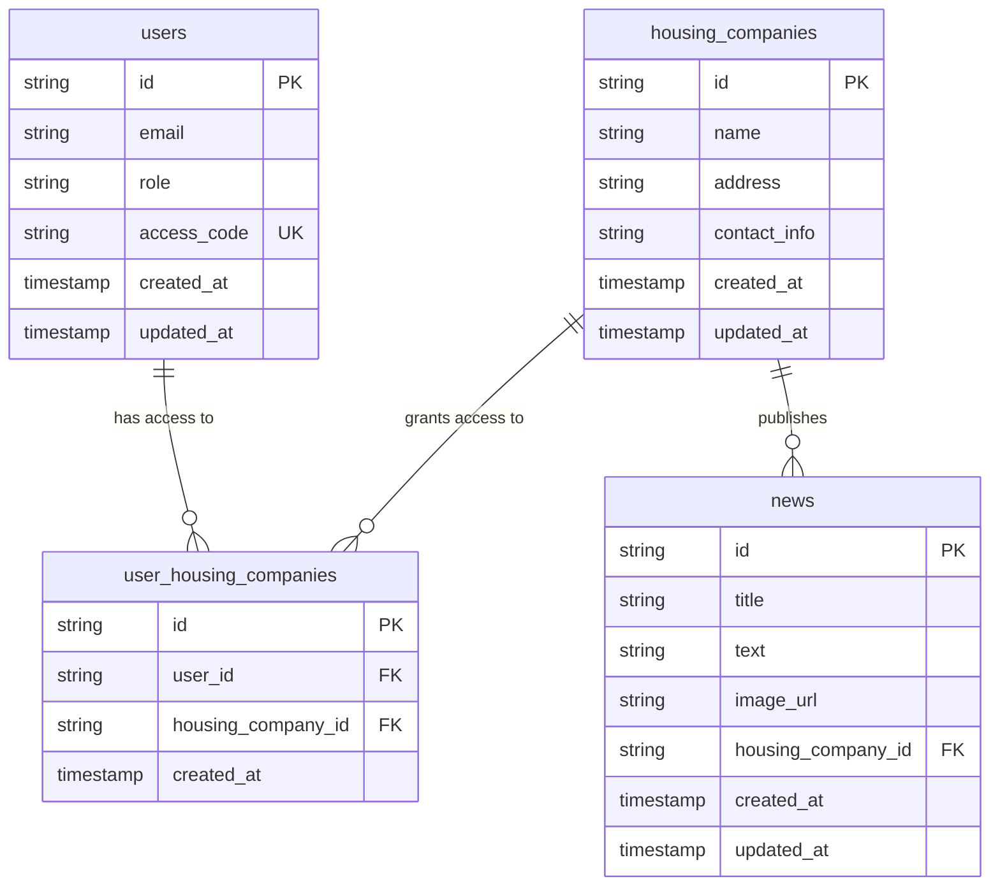
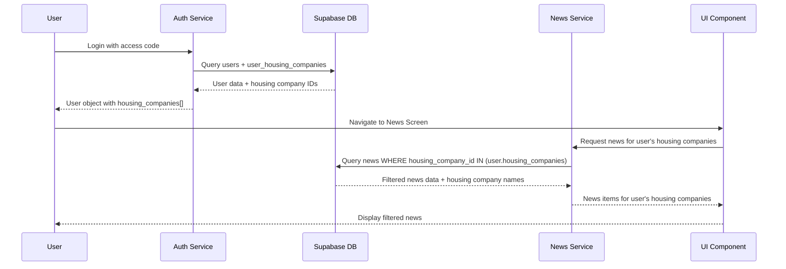

# Role-Based News Filtering Implementation Plan

## Overview

This document outlines the implementation plan for housing company-based news access control in the AlpoApp. Users will only see news from housing companies they have access to, based on their user-housing company relationships.

## Current System Analysis

### Existing Database Structure
- **users table**: Contains `id`, `email`, `role`, `access_code`
- **news table**: Contains `id`, `title`, `text`, `image_url`, `created_at`

### Current Code Structure
- [`NewsService`](../src/services/newsService.ts): Handles news fetching from Supabase
- [`useNews`](../src/services/useNews.ts): React hook for news management
- [`authService`](../src/services/auth.ts): Handles user authentication
- [`UutisetScreen`](../src/screens/UutisetScreen.tsx): Displays news list

## Database Schema Changes

### Entity Relationship Diagram



## SQL Migration Scripts

### Step 1: Create Housing Companies Table

```sql
-- Create housing_companies table
CREATE TABLE housing_companies (
    id UUID PRIMARY KEY DEFAULT gen_random_uuid(),
    name VARCHAR(255) NOT NULL,
    address TEXT,
    contact_info TEXT,
    created_at TIMESTAMP WITH TIME ZONE DEFAULT NOW(),
    updated_at TIMESTAMP WITH TIME ZONE DEFAULT NOW()
);

-- Add trigger for updated_at
CREATE OR REPLACE FUNCTION update_updated_at_column()
RETURNS TRIGGER AS $$
BEGIN
    NEW.updated_at = NOW();
    RETURN NEW;
END;
$$ language 'plpgsql';

CREATE TRIGGER update_housing_companies_updated_at 
    BEFORE UPDATE ON housing_companies 
    FOR EACH ROW EXECUTE FUNCTION update_updated_at_column();
```

### Step 2: Create User-Housing Company Junction Table

```sql
-- Create user_housing_companies junction table
CREATE TABLE user_housing_companies (
    id UUID PRIMARY KEY DEFAULT gen_random_uuid(),
    user_id UUID NOT NULL REFERENCES users(id) ON DELETE CASCADE,
    housing_company_id UUID NOT NULL REFERENCES housing_companies(id) ON DELETE CASCADE,
    created_at TIMESTAMP WITH TIME ZONE DEFAULT NOW(),
    UNIQUE(user_id, housing_company_id)
);

-- Add indexes for performance
CREATE INDEX idx_user_housing_companies_user_id ON user_housing_companies(user_id);
CREATE INDEX idx_user_housing_companies_housing_company_id ON user_housing_companies(housing_company_id);
```

### Step 3: Modify News Table

```sql
-- Add housing_company_id to news table
ALTER TABLE news 
ADD COLUMN housing_company_id UUID REFERENCES housing_companies(id) ON DELETE CASCADE;

-- Create index for better query performance
CREATE INDEX idx_news_housing_company_id ON news(housing_company_id);

-- Add trigger for updated_at if not exists
CREATE TRIGGER update_news_updated_at 
    BEFORE UPDATE ON news 
    FOR EACH ROW EXECUTE FUNCTION update_updated_at_column();
```

### Step 4: Sample Data (Optional)

```sql
-- Insert sample housing companies
INSERT INTO housing_companies (name, address, contact_info) VALUES
('Asunto Oy Keskuskatu 1', 'Keskuskatu 1, 00100 Helsinki', 'info@keskuskatu1.fi'),
('Asunto Oy Puistotie 5', 'Puistotie 5, 00200 Helsinki', 'hallitus@puistotie5.fi'),
('Asunto Oy Rantakatu 10', 'Rantakatu 10, 00300 Helsinki', 'yhtiot@rantakatu10.fi');

-- Example: Assign existing users to housing companies
-- (Replace with actual user IDs and housing company IDs)
INSERT INTO user_housing_companies (user_id, housing_company_id)
SELECT u.id, hc.id 
FROM users u, housing_companies hc 
WHERE u.access_code = 'ADMIN001' AND hc.name = 'Asunto Oy Keskuskatu 1';
```

## Code Changes Required

### 1. Update Type Definitions

#### [`src/services/auth.ts`](../src/services/auth.ts) - User Interface

```typescript
export interface User {
  id: string;
  email?: string;
  role: string;
  access_code: string;
  housing_companies?: string[]; // Array of housing company IDs
}
```

#### [`src/services/useNews.ts`](../src/services/useNews.ts) - NewsItem Interface

```typescript
export interface NewsItem {
  id: string;
  title: string;
  text: string;
  imagePath?: string;
  image_url?: string;
  created_at?: string;
  housing_company_id: string;
  housing_company_name?: string;
}
```

### 2. Update NewsService

#### [`src/services/newsService.ts`](../src/services/newsService.ts) - Add Role-Based Filtering

```typescript
interface SupabaseNewsItem {
  id: string;
  title: string;
  text: string;
  image_url: string | null;
  created_at: string;
  housing_company_id: string;
  housing_companies?: {
    name: string;
  };
}

export class NewsService {
  // Add method to fetch news for specific housing companies
  async fetchNewsForHousingCompanies(housingCompanyIds: string[]): Promise<NewsItem[]> {
    if (!supabase) {
      throw new Error('Supabase not available');
    }

    if (housingCompanyIds.length === 0) {
      return []; // No housing companies = no news
    }

    const { data, error } = await supabase
      .from('news')
      .select(`
        *,
        housing_companies (
          name
        )
      `)
      .in('housing_company_id', housingCompanyIds)
      .order('created_at', { ascending: false });

    if (error) {
      throw new Error(`Failed to fetch news: ${error.message}`);
    }

    return this.transformSupabaseData(data || []);
  }

  // Update existing fetchNews to include housing company info
  async fetchNews(): Promise<NewsItem[]> {
    if (!supabase) {
      throw new Error('Supabase not available');
    }

    const { data, error } = await supabase
      .from('news')
      .select(`
        *,
        housing_companies (
          name
        )
      `)
      .order('created_at', { ascending: false });

    if (error) {
      throw new Error(`Failed to fetch news: ${error.message}`);
    }

    return this.transformSupabaseData(data || []);
  }

  async fetchNewsSince(timestamp: Date, housingCompanyIds?: string[]): Promise<NewsItem[]> {
    if (!supabase) {
      throw new Error('Supabase not available');
    }

    let query = supabase
      .from('news')
      .select(`
        *,
        housing_companies (
          name
        )
      `)
      .gt('created_at', timestamp.toISOString())
      .order('created_at', { ascending: false });

    // Apply housing company filter if provided
    if (housingCompanyIds && housingCompanyIds.length > 0) {
      query = query.in('housing_company_id', housingCompanyIds);
    }

    const { data, error } = await query;

    if (error) {
      throw new Error(`Failed to fetch new news: ${error.message}`);
    }

    return this.transformSupabaseData(data || []);
  }

  private transformSupabaseData(data: SupabaseNewsItem[]): NewsItem[] {
    return data.map(item => ({
      id: item.id,
      title: item.title,
      text: item.text,
      image_url: item.image_url || undefined,
      imagePath: item.image_url || undefined, // Backward compatibility
      created_at: item.created_at,
      housing_company_id: item.housing_company_id,
      housing_company_name: item.housing_companies?.name,
    }));
  }
}
```

### 3. Update Authentication Service

#### [`src/services/auth.ts`](../src/services/auth.ts) - Fetch User's Housing Companies

```typescript
async signInWithAccessCode(accessCode: string): Promise<{ user: User | null; error: string | null }> {
  // Use mock auth if Supabase is not configured
  if (USE_MOCK_AUTH || !supabase) {
    return mockAuthService.signInWithAccessCode(accessCode);
  }

  try {
    // Query the users table with housing companies
    const { data, error } = await supabase
      .from('users')
      .select(`
        *,
        user_housing_companies (
          housing_company_id
        )
      `)
      .eq('access_code', accessCode)
      .single();

    if (error || !data) {
      return { user: null, error: 'Invalid access code' };
    }

    const housingCompanyIds = data.user_housing_companies?.map(
      (uhc: any) => uhc.housing_company_id
    ) || [];

    // Create a session for the user (existing logic)
    const { data: sessionData, error: sessionError } = await supabase.auth.signInWithPassword({
      email: data.email,
      password: accessCode,
    });

    if (sessionError) {
      // Fallback for custom authentication
      return { 
        user: {
          id: data.id,
          email: data.email,
          role: data.role,
          access_code: data.access_code,
          housing_companies: housingCompanyIds,
        }, 
        error: null 
      };
    }

    return { 
      user: {
        id: data.id,
        email: data.email,
        role: data.role,
        access_code: data.access_code,
        housing_companies: housingCompanyIds,
      }, 
      error: null 
    };
  } catch (error) {
    return { user: null, error: 'Authentication failed' };
  }
}
```

### 4. Update useNews Hook

#### [`src/services/useNews.ts`](../src/services/useNews.ts) - Add User Context

```typescript
interface UseNewsConfig {
  useMockData?: boolean;
  syncInterval?: number;
  enableBackgroundSync?: boolean;
  user?: User; // Add user context
}

export function useNews(config: UseNewsConfig = {}): UseNewsReturn {
  const {
    useMockData = false,
    syncInterval = 5 * 60 * 1000,
    enableBackgroundSync = true,
    user,
  } = config;

  // ... existing state declarations ...

  useEffect(() => {
    if (useMockData) {
      setNews(mockNewsData);
      setLoading(false);
      return;
    }

    // Initialize services
    newsServiceRef.current = new NewsService();
    
    const syncConfig: SyncConfig = {
      interval: syncInterval,
      enabled: enableBackgroundSync,
      onUpdate: (updatedNews) => {
        setNews(updatedNews);
        setLastSyncTime(new Date());
        setSyncStatus('idle');
      },
      onError: (syncError) => {
        console.error('Background sync error:', syncError);
        setSyncStatus('error');
        if (news.length === 0) {
          setNews(mockNewsData);
          setError('Failed to load news from server, showing offline content');
        }
      },
      user, // Pass user to sync config
    };

    syncManagerRef.current = new BackgroundSyncManager(
      newsServiceRef.current,
      syncConfig
    );

    // Initial load
    loadNews();

    // Start background sync
    if (enableBackgroundSync) {
      syncManagerRef.current.start();
    }

    return () => {
      syncManagerRef.current?.stop();
    };
  }, [useMockData, syncInterval, enableBackgroundSync, user?.id]);

  const loadNews = async (): Promise<void> => {
    if (useMockData) {
      setNews(mockNewsData);
      setLoading(false);
      return;
    }

    setLoading(true);
    setSyncStatus('syncing');
    setError(null);

    try {
      let fetchedNews: NewsItem[];
      
      if (user?.housing_companies && user.housing_companies.length > 0) {
        // Fetch news for user's housing companies
        fetchedNews = await newsServiceRef.current!.fetchNewsForHousingCompanies(
          user.housing_companies
        );
      } else {
        // No housing companies = no news
        fetchedNews = [];
        setError('No housing companies assigned to your account');
      }

      newsServiceRef.current!.updateCache(fetchedNews);
      setNews(fetchedNews);
      setLastSyncTime(new Date());
      setSyncStatus('idle');
    } catch (loadError) {
      console.error('Failed to load news:', loadError);
      setError((loadError as Error).message);
      setSyncStatus('error');
      
      // Fallback to cached data or mock data
      const { news: cachedNews } = newsServiceRef.current!.getCache();
      if (cachedNews.length > 0) {
        setNews(cachedNews);
        setError('Using cached news data');
      } else {
        setNews(mockNewsData);
        setError('Failed to load news, showing offline content');
      }
    } finally {
      setLoading(false);
    }
  };

  // ... rest of the hook remains the same ...
}
```

### 5. Update Background Sync

#### [`src/services/backgroundSync.ts`](../src/services/backgroundSync.ts) - Add User Context

```typescript
export interface SyncConfig {
  interval: number;
  enabled: boolean;
  onUpdate: (news: NewsItem[]) => void;
  onError: (error: Error) => void;
  user?: User; // Add user context
}

export class BackgroundSyncManager {
  // ... existing code ...

  private async performSync(): Promise<void> {
    try {
      const { lastSyncTime } = this.newsService.getCache();
      let newNews: NewsItem[];

      if (lastSyncTime) {
        // Incremental sync with user's housing companies
        if (this.config.user?.housing_companies && this.config.user.housing_companies.length > 0) {
          newNews = await this.newsService.fetchNewsSince(
            lastSyncTime, 
            this.config.user.housing_companies
          );
        } else {
          newNews = [];
        }
      } else {
        // Full sync with user's housing companies
        if (this.config.user?.housing_companies && this.config.user.housing_companies.length > 0) {
          newNews = await this.newsService.fetchNewsForHousingCompanies(
            this.config.user.housing_companies
          );
        } else {
          newNews = [];
        }
      }

      if (newNews.length > 0) {
        const { news: cachedNews } = this.newsService.getCache();
        const updatedNews = this.mergeNews(cachedNews, newNews);
        this.newsService.updateCache(updatedNews);
        this.config.onUpdate(updatedNews);
      }
    } catch (error) {
      this.config.onError(error as Error);
    }
  }

  // ... rest of the class remains the same ...
}
```

### 6. Update UutisetScreen

#### [`src/screens/UutisetScreen.tsx`](../src/screens/UutisetScreen.tsx) - Pass User Context

```typescript
import React, { useContext, useState, useEffect } from 'react';
import { ScrollView, StyleSheet, Text, View } from 'react-native';
import { ThemeContext } from '../context/ThemeContext';
import { useNews } from '../services/useNews';
import { NewsCard } from '../components/NewsCard';
import { User } from '../services/auth';
import AsyncStorage from '@react-native-async-storage/async-storage';

export const UutisetScreen: React.FC = () => {
  const { isDarkMode } = useContext(ThemeContext);
  const [user, setUser] = useState<User | null>(null);
  
  useEffect(() => {
    const loadUser = async () => {
      try {
        const userData = await AsyncStorage.getItem('user');
        if (userData) {
          setUser(JSON.parse(userData));
        }
      } catch (error) {
        console.error('Failed to load user:', error);
      }
    };
    
    loadUser();
  }, []);

  const { news, loading, error } = useNews({ user: user || undefined });

  if (loading) {
    return (
      <View style={[styles.container, styles.centered, isDarkMode ? styles.containerDark : null]}>
        <Text style={isDarkMode ? styles.textDark : styles.text}>Loading news...</Text>
      </View>
    );
  }

  if (error && news.length === 0) {
    return (
      <View style={[styles.container, styles.centered, isDarkMode ? styles.containerDark : null]}>
        <Text style={isDarkMode ? styles.textDark : styles.text}>{error}</Text>
      </View>
    );
  }

  return (
    <ScrollView style={[styles.container, isDarkMode ? styles.containerDark : null]}>
      {news.map((item) => (
        <NewsCard key={item.id} news={item} />
      ))}
    </ScrollView>
  );
};

const styles = StyleSheet.create({
  container: {
    flex: 1,
    backgroundColor: '#F5F5F5',
  },
  containerDark: {
    backgroundColor: '#121212',
  },
  centered: {
    justifyContent: 'center',
    alignItems: 'center',
  },
  text: {
    color: '#333',
    fontSize: 16,
  },
  textDark: {
    color: '#FFF',
    fontSize: 16,
  },
});
```

## Implementation Flow



## Security Considerations

1. **Database Level Security**: News filtering happens at the database query level, not in the application
2. **User Validation**: Always validate user authentication before fetching news
3. **Access Control**: Users can only see news from housing companies they're explicitly assigned to
4. **Data Integrity**: Foreign key constraints ensure data consistency

## Performance Optimizations

1. **Indexes**: Created on `user_housing_companies(user_id)`, `user_housing_companies(housing_company_id)`, and `news(housing_company_id)`
2. **Caching**: Existing news caching mechanism remains intact
3. **Efficient Queries**: Using JOIN queries to fetch related data in single requests
4. **Background Sync**: Incremental sync considers user's housing company access

## Testing Strategy

1. **Unit Tests**: Test news filtering logic in [`NewsService`](../src/services/newsService.ts)
2. **Integration Tests**: Test user authentication with housing company data
3. **Database Tests**: Verify foreign key constraints and data integrity
4. **User Experience Tests**: Test different user scenarios (no access, single company, multiple companies)

## Migration Strategy

1. **Phase 1**: Create new database tables and relationships
2. **Phase 2**: Migrate existing news to assign housing companies
3. **Phase 3**: Update application code to use new filtering
4. **Phase 4**: Test with existing users and data
5. **Phase 5**: Deploy and monitor

## Benefits

1. **Scalable**: Users can belong to multiple housing companies
2. **Secure**: News filtering happens at the database level
3. **Flexible**: Easy to add/remove housing company access for users
4. **Maintainable**: Clear separation of concerns
5. **Performance**: Proper indexing ensures fast queries
6. **User Experience**: Users only see relevant news

## Future Enhancements

1. **Admin Interface**: Create interface to manage user-housing company relationships
2. **Role-Based Permissions**: Add different permission levels within housing companies
3. **News Categories**: Add categories within housing companies
4. **Notification System**: Send notifications for news from user's housing companies
5. **Analytics**: Track news engagement per housing company

## Conclusion

This implementation provides a robust, scalable solution for housing company-based news filtering. The database-level filtering ensures security and performance, while the modular code structure maintains flexibility for future enhancements.