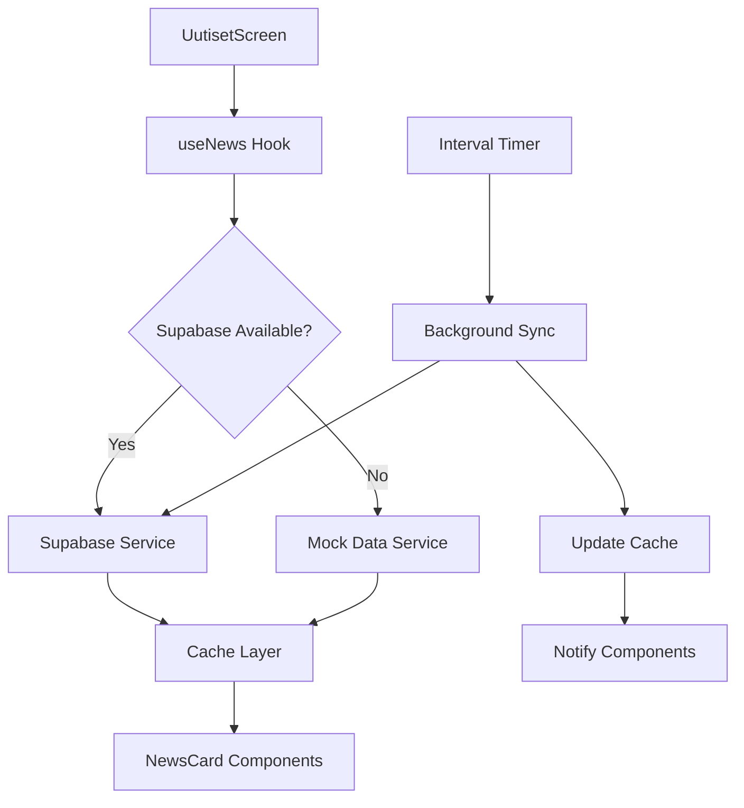
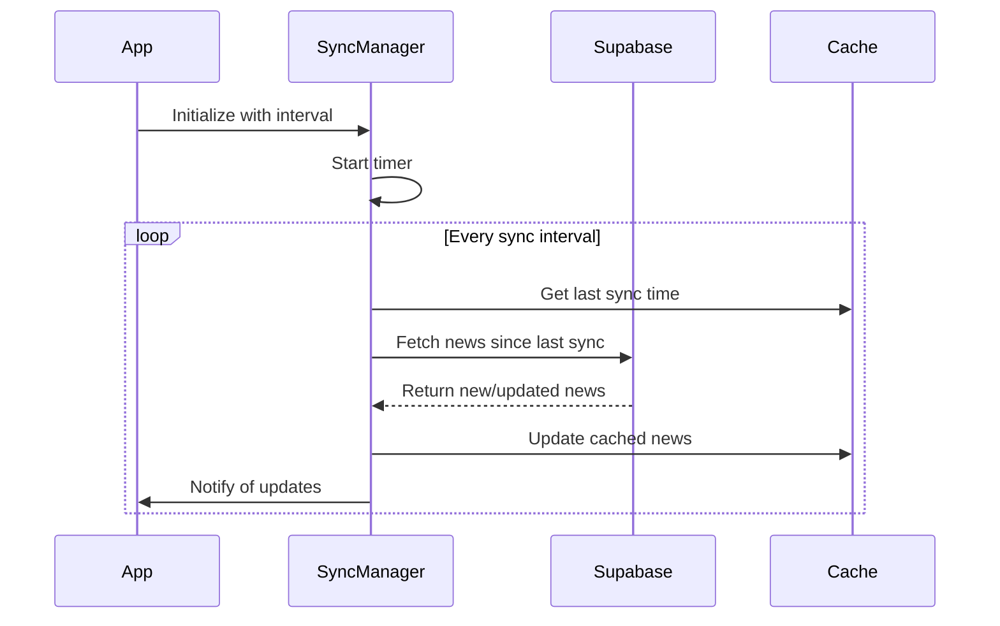

# Supabase News Integration Plan

## Overview
This plan outlines how to integrate Supabase database for news loading while maintaining the existing mockup implementation as a fallback. The solution will include automatic news checking at specified intervals and a seamless transition between mock and real data.

## Current Architecture Analysis

Based on the code review, the current implementation has:
- [`useNews.ts`](../src/services/useNews.ts:1) hook with mock data
- [`NewsCard.tsx`](../src/components/NewsCard.tsx:1) component for rendering news items
- [`UutisetScreen.tsx`](../src/screens/UutisetScreen.tsx:1) consuming the news data
- [`supabase.ts`](../src/services/supabase.ts:1) client configuration already in place

## Database Schema Design

### Supabase Table Structure
```sql
CREATE TABLE news (
  id UUID DEFAULT gen_random_uuid() PRIMARY KEY,
  title TEXT NOT NULL,
  text TEXT NOT NULL,
  image_url TEXT,
  created_at TIMESTAMP WITH TIME ZONE DEFAULT NOW()
);

-- Enable Row Level Security
ALTER TABLE news ENABLE ROW LEVEL SECURITY;

-- Create policy for public read access
CREATE POLICY "Allow public read access" ON news
  FOR SELECT USING (true);
```

## Implementation Plan

### Phase 1: Enhanced Data Model and Service Layer



#### 1.1 Enhanced NewsItem Interface
- Extend the current [`NewsItem`](../src/services/useNews.ts:3) interface to support both mock and Supabase data
- Add optional fields for database integration while maintaining backward compatibility

```typescript
// Enhanced NewsItem interface
export interface NewsItem {
  id: string;
  title: string;
  text: string;
  imagePath?: string; // Keep for backward compatibility
  image_url?: string; // New field for Supabase
  created_at?: string; // Timestamp from database
}
```

#### 1.2 News Service Architecture
- Create a unified news service that handles both mock and Supabase data
- Implement caching mechanism for offline support
- Add error handling and fallback strategies

### Phase 2: Supabase Integration Layer

#### 2.1 Database Operations Service
Create `src/services/newsService.ts`:

```typescript
import { supabase } from './supabase';
import { NewsItem } from './useNews';

interface SupabaseNewsItem {
  id: string;
  title: string;
  text: string;
  image_url: string | null;
  created_at: string;
}

export class NewsService {
  private cache: NewsItem[] = [];
  private lastSyncTime: Date | null = null;

  async fetchNews(): Promise<NewsItem[]> {
    if (!supabase) {
      throw new Error('Supabase not available');
    }

    const { data, error } = await supabase
      .from('news')
      .select('*')
      .order('created_at', { ascending: false });

    if (error) {
      throw new Error(`Failed to fetch news: ${error.message}`);
    }

    return this.transformSupabaseData(data || []);
  }

  async fetchNewsSince(timestamp: Date): Promise<NewsItem[]> {
    if (!supabase) {
      throw new Error('Supabase not available');
    }

    const { data, error } = await supabase
      .from('news')
      .select('*')
      .gt('created_at', timestamp.toISOString())
      .order('created_at', { ascending: false });

    if (error) {
      throw new Error(`Failed to fetch new news: ${error.message}`);
    }

    return this.transformSupabaseData(data || []);
  }

  private transformSupabaseData(data: SupabaseNewsItem[]): NewsItem[] {
    return data.map(item => ({
      id: item.id,
      title: item.title,
      text: item.text,
      image_url: item.image_url || undefined,
      imagePath: item.image_url || undefined, // Backward compatibility
      created_at: item.created_at,
    }));
  }

  updateCache(news: NewsItem[]): void {
    this.cache = news;
    this.lastSyncTime = new Date();
  }

  getCache(): { news: NewsItem[]; lastSyncTime: Date | null } {
    return { news: this.cache, lastSyncTime: this.lastSyncTime };
  }
}
```

#### 2.2 Real-time Synchronization
Create `src/services/backgroundSync.ts`:

```typescript
import { NewsService } from './newsService';
import { NewsItem } from './useNews';

export interface SyncConfig {
  interval: number; // milliseconds
  enabled: boolean;
  onUpdate?: (news: NewsItem[]) => void;
  onError?: (error: Error) => void;
}

export class BackgroundSyncManager {
  private newsService: NewsService;
  private config: SyncConfig;
  private intervalId: NodeJS.Timeout | null = null;
  private isActive = false;

  constructor(newsService: NewsService, config: SyncConfig) {
    this.newsService = newsService;
    this.config = config;
  }

  start(): void {
    if (!this.config.enabled || this.intervalId) return;

    this.isActive = true;
    this.intervalId = setInterval(() => {
      this.performSync();
    }, this.config.interval);

    // Perform initial sync
    this.performSync();
  }

  stop(): void {
    if (this.intervalId) {
      clearInterval(this.intervalId);
      this.intervalId = null;
    }
    this.isActive = false;
  }

  private async performSync(): Promise<void> {
    if (!this.isActive) return;

    try {
      const { lastSyncTime } = this.newsService.getCache();
      
      let news: NewsItem[];
      if (lastSyncTime) {
        // Fetch only new news since last sync
        const newNews = await this.newsService.fetchNewsSince(lastSyncTime);
        if (newNews.length > 0) {
          const { news: cachedNews } = this.newsService.getCache();
          news = [...newNews, ...cachedNews];
        } else {
          return; // No new news
        }
      } else {
        // First sync - fetch all news
        news = await this.newsService.fetchNews();
      }

      this.newsService.updateCache(news);
      this.config.onUpdate?.(news);
    } catch (error) {
      this.config.onError?.(error as Error);
    }
  }

  updateConfig(newConfig: Partial<SyncConfig>): void {
    this.config = { ...this.config, ...newConfig };
    
    if (this.intervalId && newConfig.interval) {
      this.stop();
      this.start();
    }
  }
}
```

### Phase 3: Enhanced useNews Hook

Update `src/services/useNews.ts`:

```typescript
import { useState, useEffect, useRef } from 'react';
import { NewsService } from './newsService';
import { BackgroundSyncManager, SyncConfig } from './backgroundSync';

export interface NewsItem {
  id: string;
  title: string;
  text: string;
  imagePath?: string;
  image_url?: string;
  created_at?: string;
}

interface UseNewsConfig {
  useMockData?: boolean;
  syncInterval?: number; // milliseconds, default 5 minutes
  enableBackgroundSync?: boolean;
}

interface UseNewsReturn {
  news: NewsItem[];
  loading: boolean;
  error: string | null;
  lastSyncTime: Date | null;
  syncStatus: 'idle' | 'syncing' | 'error';
  refetch: () => Promise<void>;
}

// Mock data (existing)
const mockNewsData: NewsItem[] = [
  {
    id: '1',
    title: 'Uutinen 1',
    text: 'Tämä on lyhyt uutinen, joka mahtuu alle kolmeen riviin.',
    imagePath: '../assets/icon1.png',
  },
  {
    id: '2',
    title: 'Uutinen 2',
    text: 'Tämä uutinen on hieman pidempi ja sen pitäisi katkaista kolmeen riviin, jotta "Lue lisää" -linkki tulee näkyviin. Tämä teksti jatkuu vielä hieman pidemmälle, jotta voimme testata leikkaamista.',
    imagePath: '../assets/icon2.png',
  },
  {
    id: '3',
    title: 'Uutinen 3',
    text: 'Tämä on todella pitkä uutinen, joka ylittää selvästi kolme riviä. Sen tarkoituksena on testata, että uutisen tekstin katkaisu ja laajennus toimivat oikein. Käyttäjä voi klikata "Lue lisää" nähdäksesi koko tekstin ja "Näytä vähemmän" piilottaakseen sen uudelleen.',
    imagePath: '../assets/icon3.png',
  },
];

export function useNews(config: UseNewsConfig = {}): UseNewsReturn {
  const {
    useMockData = false,
    syncInterval = 5 * 60 * 1000, // 5 minutes
    enableBackgroundSync = true,
  } = config;

  const [news, setNews] = useState<NewsItem[]>([]);
  const [loading, setLoading] = useState(true);
  const [error, setError] = useState<string | null>(null);
  const [lastSyncTime, setLastSyncTime] = useState<Date | null>(null);
  const [syncStatus, setSyncStatus] = useState<'idle' | 'syncing' | 'error'>('idle');

  const newsServiceRef = useRef<NewsService>();
  const syncManagerRef = useRef<BackgroundSyncManager>();

  useEffect(() => {
    if (useMockData) {
      // Use mock data
      setNews(mockNewsData);
      setLoading(false);
      return;
    }

    // Initialize services
    newsServiceRef.current = new NewsService();
    
    const syncConfig: SyncConfig = {
      interval: syncInterval,
      enabled: enableBackgroundSync,
      onUpdate: (updatedNews) => {
        setNews(updatedNews);
        setLastSyncTime(new Date());
        setSyncStatus('idle');
      },
      onError: (syncError) => {
        console.error('Background sync error:', syncError);
        setSyncStatus('error');
        // Fallback to mock data on error
        if (news.length === 0) {
          setNews(mockNewsData);
          setError('Failed to load news from server, showing offline content');
        }
      },
    };

    syncManagerRef.current = new BackgroundSyncManager(
      newsServiceRef.current,
      syncConfig
    );

    // Initial load
    loadNews();

    // Start background sync
    if (enableBackgroundSync) {
      syncManagerRef.current.start();
    }

    return () => {
      syncManagerRef.current?.stop();
    };
  }, [useMockData, syncInterval, enableBackgroundSync]);

  const loadNews = async (): Promise<void> => {
    if (useMockData) {
      setNews(mockNewsData);
      setLoading(false);
      return;
    }

    setLoading(true);
    setSyncStatus('syncing');
    setError(null);

    try {
      const fetchedNews = await newsServiceRef.current!.fetchNews();
      newsServiceRef.current!.updateCache(fetchedNews);
      setNews(fetchedNews);
      setLastSyncTime(new Date());
      setSyncStatus('idle');
    } catch (loadError) {
      console.error('Failed to load news:', loadError);
      setError((loadError as Error).message);
      setSyncStatus('error');
      
      // Fallback to cached data or mock data
      const { news: cachedNews } = newsServiceRef.current!.getCache();
      if (cachedNews.length > 0) {
        setNews(cachedNews);
        setError('Using cached news data');
      } else {
        setNews(mockNewsData);
        setError('Failed to load news, showing offline content');
      }
    } finally {
      setLoading(false);
    }
  };

  const refetch = async (): Promise<void> => {
    await loadNews();
  };

  return {
    news,
    loading,
    error,
    lastSyncTime,
    syncStatus,
    refetch,
  };
}
```

### Phase 4: Configuration Management

Create `src/config/newsConfig.ts`:

```typescript
export interface NewsConfig {
  dataSource: 'mock' | 'supabase' | 'hybrid';
  syncInterval: number; // milliseconds
  cacheTimeout: number; // milliseconds
  maxRetries: number;
  enableNotifications: boolean;
  debugMode: boolean;
}

export const defaultNewsConfig: NewsConfig = {
  dataSource: 'hybrid', // Try Supabase, fallback to mock
  syncInterval: 5 * 60 * 1000, // 5 minutes
  cacheTimeout: 30 * 60 * 1000, // 30 minutes
  maxRetries: 3,
  enableNotifications: false,
  debugMode: __DEV__,
};

export const newsConfigPresets = {
  development: {
    ...defaultNewsConfig,
    dataSource: 'mock' as const,
    syncInterval: 30 * 1000, // 30 seconds for testing
    debugMode: true,
  },
  production: {
    ...defaultNewsConfig,
    dataSource: 'supabase' as const,
    syncInterval: 10 * 60 * 1000, // 10 minutes
    debugMode: false,
  },
};
```

## Migration Strategy

### Step 1: Preparation
1. **Database Setup**
   - Create Supabase table with the defined schema
   - Set up Row Level Security policies
   - Insert sample news data for testing

2. **Environment Configuration**
   - Ensure `.env` file has correct Supabase credentials
   - Verify [`supabase.ts`](../src/services/supabase.ts:1) client configuration

### Step 2: Service Layer Implementation
1. **Create News Service** (`src/services/newsService.ts`)
   - Implement Supabase operations
   - Add caching mechanism
   - Handle error scenarios

2. **Create Background Sync** (`src/services/backgroundSync.ts`)
   - Implement interval-based checking
   - Add app state awareness
   - Handle network connectivity

3. **Add Configuration** (`src/config/newsConfig.ts`)
   - Define configuration options
   - Create environment-specific presets

### Step 3: Hook Enhancement
1. **Update useNews Hook**
   - Extend with new functionality
   - Maintain backward compatibility
   - Add comprehensive error handling

2. **Testing Integration**
   - Test with mock data (existing functionality)
   - Test with Supabase data
   - Test fallback mechanisms

### Step 4: Component Updates (Optional)
1. **Update NewsCard Component**
   - Handle new image_url field
   - Add loading states
   - Improve error handling

2. **Update UutisetScreen**
   - Add sync status indicators
   - Implement pull-to-refresh
   - Show last sync time

### Step 5: Gradual Rollout
1. **Development Phase**
   - Deploy with mock data as default
   - Test Supabase integration thoroughly

2. **Staging Phase**
   - Enable hybrid mode (Supabase with mock fallback)
   - Monitor performance and error rates

3. **Production Phase**
   - Full migration to Supabase
   - Keep mock data as emergency fallback

## Background Sync Implementation Details

### Sync Strategy


### Sync Configuration Options
- **Interval Options**: 1min, 5min, 15min, 30min, 1hour
- **Smart Sync**: Only sync when app is active
- **Network Aware**: Pause sync on poor connection
- **Battery Optimization**: Reduce frequency on low battery

### App State Handling
```typescript
// Add to BackgroundSyncManager
import { AppState, AppStateStatus } from 'react-native';

export class BackgroundSyncManager {
  private appStateSubscription: any;

  constructor(newsService: NewsService, config: SyncConfig) {
    // ... existing code
    
    // Listen to app state changes
    this.appStateSubscription = AppState.addEventListener(
      'change',
      this.handleAppStateChange.bind(this)
    );
  }

  private handleAppStateChange(nextAppState: AppStateStatus): void {
    if (nextAppState === 'active' && !this.isActive) {
      // App became active, perform immediate sync
      this.performSync();
    } else if (nextAppState === 'background') {
      // App went to background, reduce sync frequency
      this.updateConfig({ interval: this.config.interval * 2 });
    }
  }

  stop(): void {
    // ... existing code
    this.appStateSubscription?.remove();
  }
}
```

## Error Handling and Fallback Strategy

### Fallback Hierarchy
1. **Primary**: Fresh Supabase data
2. **Secondary**: Cached Supabase data
3. **Tertiary**: Mock data
4. **Fallback**: Empty state with retry option

### Error Scenarios and Responses
- **Network connectivity issues**: Use cached data, show offline indicator
- **Supabase service unavailable**: Fallback to mock data, retry later
- **Authentication failures**: Use public data only, log error
- **Rate limiting**: Increase sync interval, use cached data
- **Data corruption**: Clear cache, refetch from source

## Performance Considerations

### Optimization Strategies
- **Caching**: Multi-level caching (memory + AsyncStorage)
- **Pagination**: Load news in chunks for large datasets
- **Image Optimization**: Lazy loading and compression
- **Background Processing**: Non-blocking sync operations
- **Memory Management**: Limit cache size, cleanup old entries

### Monitoring Metrics
- Sync success/failure rates
- Network usage tracking
- Cache hit/miss ratios
- User engagement metrics
- App performance impact

## Security Considerations

### Data Protection
- Row Level Security on Supabase
- Input validation and sanitization
- Secure image URL handling
- Rate limiting protection

### Privacy
- Minimal data collection
- User consent for notifications
- Transparent sync behavior
- Data retention policies

## Testing Strategy

### Unit Tests
```typescript
// Example test structure
describe('NewsService', () => {
  test('should fetch news from Supabase', async () => {
    // Test Supabase integration
  });

  test('should handle network errors gracefully', async () => {
    // Test error handling
  });

  test('should cache news data correctly', () => {
    // Test caching mechanism
  });
});

describe('BackgroundSyncManager', () => {
  test('should sync at specified intervals', () => {
    // Test interval functionality
  });

  test('should handle app state changes', () => {
    // Test app state awareness
  });
});

describe('useNews Hook', () => {
  test('should return mock data when configured', () => {
    // Test mock data mode
  });

  test('should fallback to mock data on error', () => {
    // Test fallback mechanism
  });
});
```

### Integration Tests
- Supabase connectivity and data fetching
- Mock data fallback scenarios
- Cache management and persistence
- Sync interval accuracy and reliability

### User Acceptance Tests
- News loading performance and user experience
- Offline functionality and data availability
- Background sync behavior and battery impact
- Error recovery and user feedback

## Deployment Checklist

### Pre-deployment
- [ ] Supabase table created and configured with proper schema
- [ ] Row Level Security policies implemented and tested
- [ ] Environment variables set in production environment
- [ ] Mock data preserved and accessible as fallback
- [ ] Background sync intervals configured appropriately
- [ ] Error handling and logging implemented
- [ ] Performance monitoring setup

### Post-deployment
- [ ] Monitor sync performance and success rates
- [ ] Track error rates and fallback usage
- [ ] Validate cache behavior and memory usage
- [ ] Confirm fallback mechanisms work as expected
- [ ] Monitor user engagement and app performance
- [ ] Collect feedback on news loading experience

## Usage Examples

### Basic Usage (Current Implementation)
```typescript
// In UutisetScreen.tsx - no changes needed
const { news } = useNews();
```

### Advanced Usage with Configuration
```typescript
// With custom configuration
const { news, loading, error, syncStatus, refetch } = useNews({
  useMockData: false, // Use Supabase
  syncInterval: 10 * 60 * 1000, // 10 minutes
  enableBackgroundSync: true,
});

// Show sync status to user
if (syncStatus === 'syncing') {
  // Show loading indicator
}

if (error) {
  // Show error message with retry option
}
```

### Development Mode
```typescript
// Force mock data for development
const { news } = useNews({
  useMockData: __DEV__, // Use mock data in development
  syncInterval: 30 * 1000, // 30 seconds for testing
});
```

This comprehensive plan ensures a robust integration of Supabase for news loading while maintaining the existing mock implementation as a reliable fallback, with automatic news checking at specified intervals for optimal user experience.