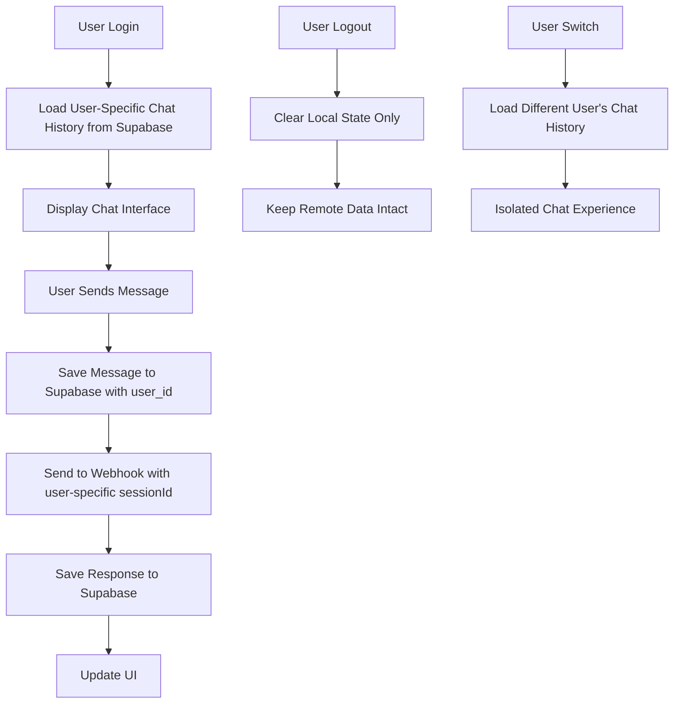

# User-Specific Chat History Implementation Plan

## Problem Statement

Currently, all users share the same chat history even after logout. The chat system uses global storage keys that persist across user sessions, causing privacy and data isolation issues.

## Current Problem Analysis

After analyzing the codebase, the core issue is identified in the [`ChatService`](../src/services/chatService.ts) implementation:

### Issues Identified:
1. **Global Storage Keys**: 
   - Session ID stored under `'chat_session_id'` key in AsyncStorage
   - Messages stored under `'chat_messages'` key in AsyncStorage
   - No user context differentiation

2. **No User Context**: 
   - [`ChatService`](../src/services/chatService.ts:8) doesn't know which user is currently logged in
   - Session management is global, not user-specific

3. **Data Leakage**: 
   - When User A logs out and User B logs in, User B sees User A's chat history
   - [`clearSession()`](../src/services/chatService.ts:117) method clears data but doesn't prevent cross-user access

## Proposed Solution: Remote Storage with Supabase

### Architecture Overview



### Database Schema Changes

#### 1. New Tables Required

**`chat_sessions` table:**
```sql
CREATE TABLE chat_sessions (
    id UUID PRIMARY KEY DEFAULT gen_random_uuid(),
    user_id UUID NOT NULL REFERENCES users(id) ON DELETE CASCADE,
    webhook_session_id VARCHAR(255) NOT NULL, -- The external webhook session ID
    created_at TIMESTAMP WITH TIME ZONE DEFAULT NOW(),
    updated_at TIMESTAMP WITH TIME ZONE DEFAULT NOW(),
    is_active BOOLEAN DEFAULT true,
    UNIQUE(user_id, webhook_session_id)
);

-- Index for performance
CREATE INDEX idx_chat_sessions_user_id ON chat_sessions(user_id);
CREATE INDEX idx_chat_sessions_active ON chat_sessions(user_id, is_active);
```

**`chat_messages` table:**
```sql
CREATE TABLE chat_messages (
    id UUID PRIMARY KEY DEFAULT gen_random_uuid(),
    user_id UUID NOT NULL REFERENCES users(id) ON DELETE CASCADE,
    session_id UUID REFERENCES chat_sessions(id) ON DELETE CASCADE,
    message_id VARCHAR(255) NOT NULL, -- Client-generated message ID
    text TEXT NOT NULL,
    is_user BOOLEAN NOT NULL,
    timestamp TIMESTAMP WITH TIME ZONE DEFAULT NOW(),
    created_at TIMESTAMP WITH TIME ZONE DEFAULT NOW()
);

-- Indexes for performance
CREATE INDEX idx_chat_messages_user_id ON chat_messages(user_id);
CREATE INDEX idx_chat_messages_session_id ON chat_messages(session_id);
CREATE INDEX idx_chat_messages_timestamp ON chat_messages(user_id, timestamp DESC);
```

#### 2. Row Level Security (RLS)

```sql
-- Enable RLS on chat tables
ALTER TABLE chat_sessions ENABLE ROW LEVEL SECURITY;
ALTER TABLE chat_messages ENABLE ROW LEVEL SECURITY;

-- RLS policies (to be implemented based on auth strategy)
-- Note: Since app uses custom auth, policies will need to be adapted
```

### Code Changes Required

#### 1. Enhanced Chat Types

**Update [`../src/types/chat.ts`](../src/types/chat.ts):**

```typescript
export interface ChatMessage {
  id: string;
  text: string;
  isUser: boolean;
  timestamp: Date;
  userId?: string; // Add user context
  sessionId?: string; // Add session context
}

export interface ChatSession {
  id: string;
  userId: string;
  webhookSessionId: string; // External webhook session ID
  createdAt: Date;
  updatedAt: Date;
  isActive: boolean;
}

export interface WebhookRequest {
  message: string;
  sessionId?: string;
  userId?: string; // Add user context for webhook
}

export interface ChatState {
  messages: ChatMessage[];
  isLoading: boolean;
  error: string | null;
  sessionID: string | null;
  userId: string | null; // Add user context
}
```

#### 2. Enhanced ChatService

**Major changes to [`../src/services/chatService.ts`](../src/services/chatService.ts):**

```typescript
import AsyncStorage from '@react-native-async-storage/async-storage';
import { supabase } from './supabase';
import { WebhookRequest, WebhookResponse, ChatMessage, ChatSession } from '../types/chat';
import { User } from './auth';

const WEBHOOK_URL = 'https://n8n.andsome.fi/webhook/c389f93f-25da-42d1-929a-17046d85c5ad';

export class ChatService {
  private currentUser: User | null = null;
  private currentSession: ChatSession | null = null;

  /**
   * Set the current user context
   */
  setUser(user: User | null): void {
    this.currentUser = user;
    this.currentSession = null; // Reset session when user changes
  }

  /**
   * Load user-specific messages from Supabase
   */
  async loadMessages(): Promise<ChatMessage[]> {
    if (!this.currentUser || !supabase) {
      return [];
    }

    try {
      const { data, error } = await supabase
        .from('chat_messages')
        .select('*')
        .eq('user_id', this.currentUser.id)
        .order('timestamp', { ascending: true });

      if (error) {
        console.error('Failed to load messages from Supabase:', error);
        return [];
      }

      return data.map(msg => ({
        id: msg.message_id,
        text: msg.text,
        isUser: msg.is_user,
        timestamp: new Date(msg.timestamp),
        userId: msg.user_id,
        sessionId: msg.session_id
      }));
    } catch (error) {
      console.error('Failed to load messages:', error);
      return [];
    }
  }

  /**
   * Save message to Supabase with user context
   */
  async saveMessage(message: ChatMessage): Promise<void> {
    if (!this.currentUser || !supabase) {
      console.warn('Cannot save message: no user context or Supabase connection');
      return;
    }

    try {
      const { error } = await supabase
        .from('chat_messages')
        .insert({
          user_id: this.currentUser.id,
          session_id: this.currentSession?.id,
          message_id: message.id,
          text: message.text,
          is_user: message.isUser,
          timestamp: message.timestamp.toISOString()
        });

      if (error) {
        console.error('Failed to save message to Supabase:', error);
      }
    } catch (error) {
      console.error('Failed to save message:', error);
    }
  }

  /**
   * Get or create user-specific session
   */
  async getOrCreateSession(): Promise<string | null> {
    if (!this.currentUser || !supabase) {
      return null;
    }

    try {
      // Try to get existing active session
      const { data: existingSessions, error: fetchError } = await supabase
        .from('chat_sessions')
        .select('*')
        .eq('user_id', this.currentUser.id)
        .eq('is_active', true)
        .order('created_at', { ascending: false })
        .limit(1);

      if (fetchError) {
        console.error('Failed to fetch existing sessions:', fetchError);
        return null;
      }

      if (existingSessions && existingSessions.length > 0) {
        this.currentSession = {
          id: existingSessions[0].id,
          userId: existingSessions[0].user_id,
          webhookSessionId: existingSessions[0].webhook_session_id,
          createdAt: new Date(existingSessions[0].created_at),
          updatedAt: new Date(existingSessions[0].updated_at),
          isActive: existingSessions[0].is_active
        };
        return existingSessions[0].webhook_session_id;
      }

      return null; // No existing session, will be created after first message
    } catch (error) {
      console.error('Failed to get or create session:', error);
      return null;
    }
  }

  /**
   * Save session to Supabase after receiving from webhook
   */
  async saveSession(webhookSessionId: string): Promise<void> {
    if (!this.currentUser || !supabase) {
      return;
    }

    try {
      const { data, error } = await supabase
        .from('chat_sessions')
        .insert({
          user_id: this.currentUser.id,
          webhook_session_id: webhookSessionId,
          is_active: true
        })
        .select()
        .single();

      if (error) {
        console.error('Failed to save session to Supabase:', error);
        return;
      }

      this.currentSession = {
        id: data.id,
        userId: data.user_id,
        webhookSessionId: data.webhook_session_id,
        createdAt: new Date(data.created_at),
        updatedAt: new Date(data.updated_at),
        isActive: data.is_active
      };
    } catch (error) {
      console.error('Failed to save session:', error);
    }
  }

  /**
   * Send message with user context
   */
  async sendMessage(message: string): Promise<WebhookResponse> {
    if (!this.currentUser) {
      throw new Error('No user context available');
    }

    // Get existing session ID
    const existingSessionId = await this.getOrCreateSession();

    const requestBody: WebhookRequest = {
      message: message.trim(),
      userId: this.currentUser.id
    };

    // Include sessionId if we have one
    if (existingSessionId) {
      requestBody.sessionId = existingSessionId;
    }

    try {
      const response = await fetch(WEBHOOK_URL, {
        method: 'POST',
        headers: {
          'Content-Type': 'application/json',
        },
        body: JSON.stringify(requestBody),
      });

      if (!response.ok) {
        throw new Error(`HTTP error! status: ${response.status}`);
      }

      const data = await response.json();

      // Save session ID if this is the first message
      if (!existingSessionId && data.sessionId) {
        await this.saveSession(data.sessionId);
      }

      return data;
    } catch (error) {
      throw new Error('Failed to send message. Please check your connection and try again.');
    }
  }

  /**
   * Get current session ID
   */
  getSessionID(): string | null {
    return this.currentSession?.webhookSessionId || null;
  }

  /**
   * Clear user-specific data on logout
   */
  async clearUserData(): Promise<void> {
    this.currentUser = null;
    this.currentSession = null;
    // Note: We don't delete data from Supabase, just clear local references
  }

  /**
   * Clear all chat data for current user (destructive operation)
   */
  async clearUserChatHistory(): Promise<void> {
    if (!this.currentUser || !supabase) {
      return;
    }

    try {
      // Delete messages first (due to foreign key constraints)
      await supabase
        .from('chat_messages')
        .delete()
        .eq('user_id', this.currentUser.id);

      // Delete sessions
      await supabase
        .from('chat_sessions')
        .delete()
        .eq('user_id', this.currentUser.id);

      this.currentSession = null;
    } catch (error) {
      console.error('Failed to clear user chat history:', error);
      throw error;
    }
  }
}

export const chatService = new ChatService();
```

#### 3. AlpoScreen Integration

**Update [`../src/screens/AlpoScreen.tsx`](../src/screens/AlpoScreen.tsx):**

```typescript
export const AlpoScreen: React.FC<AlpoScreenProps> = ({ user }) => {
  const { isDarkMode } = useContext(ThemeContext);
  
  const [chatState, setChatState] = useState<ChatState>({
    messages: [],
    isLoading: false,
    error: null,
    sessionID: null,
    userId: user?.id || null,
  });

  // Set user context and load chat history when user changes
  useEffect(() => {
    if (user) {
      chatService.setUser(user);
      loadChatHistory();
    }
  }, [user]);

  const loadChatHistory = async () => {
    if (!user) return;

    try {
      setChatState(prev => ({ ...prev, isLoading: true }));
      
      const messages = await chatService.loadMessages();
      const sessionID = chatService.getSessionID();
      
      setChatState(prev => ({
        ...prev,
        messages,
        sessionID,
        userId: user.id,
        isLoading: false,
      }));
    } catch (error) {
      console.error('Failed to load chat history:', error);
      setChatState(prev => ({
        ...prev,
        error: 'Failed to load chat history',
        isLoading: false,
      }));
    }
  };

  const addMessage = async (text: string, isUser: boolean): Promise<ChatMessage> => {
    const message: ChatMessage = {
      id: generateMessageId(),
      text,
      isUser,
      timestamp: new Date(),
      userId: user?.id,
    };

    setChatState(prev => ({
      ...prev,
      messages: [...prev.messages, message],
    }));

    // Save to Supabase
    await chatService.saveMessage(message);

    return message;
  };

  const handleClearChat = useCallback(() => {
    Alert.alert(
      'Tyhjennä keskustelu',
      'Haluatko varmasti tyhjentää koko keskustelun? Tätä toimintoa ei voi peruuttaa.',
      [
        {
          text: 'Peruuta',
          style: 'cancel',
        },
        {
          text: 'Tyhjennä',
          style: 'destructive',
          onPress: async () => {
            try {
              await chatService.clearUserChatHistory();
              setChatState(prev => ({
                ...prev,
                messages: [],
                sessionID: null,
              }));
            } catch (error) {
              console.error('Failed to clear chat:', error);
              setChatState(prev => ({
                ...prev,
                error: 'Failed to clear chat history',
              }));
            }
          },
        },
      ]
    );
  }, []);

  // Rest of the component remains similar...
};
```

#### 4. App-Level Logout Handling

**Update [`../App.tsx`](../App.tsx) logout handler:**

```typescript
const handleLogout = async () => {
  try {
    // Clear user data from chat service
    await chatService.clearUserData();
    
    // Clear user from AsyncStorage
    await AsyncStorage.removeItem('user');
    
    setUser(null);
    setIsAuthenticated(false);
  } catch (error) {
    console.error('Logout error:', error);
    // Still proceed with logout even if chat cleanup fails
    setUser(null);
    setIsAuthenticated(false);
  }
};
```

### Implementation Steps

#### Phase 1: Database Setup
1. **Create Migration Files**
   - `AlpoApp/db/migrations/20251106_create_chat_sessions_table.sql`
   - `AlpoApp/db/migrations/20251106_create_chat_messages_table.sql`
   - `AlpoApp/db/migrations/20251106_add_chat_indexes.sql`

2. **Apply Migrations**
   - Run migrations in Supabase dashboard or via CLI
   - Verify table creation and relationships

#### Phase 2: Service Layer Updates
1. **Update Chat Types** ([`../src/types/chat.ts`](../src/types/chat.ts))
   - Add user and session context to interfaces
   - Update webhook request/response types

2. **Enhance ChatService** ([`../src/services/chatService.ts`](../src/services/chatService.ts))
   - Implement user context management
   - Add Supabase integration for messages and sessions
   - Update session management to be user-specific
   - Add error handling and fallbacks

#### Phase 3: UI Integration
1. **Update AlpoScreen** ([`../src/screens/AlpoScreen.tsx`](../src/screens/AlpoScreen.tsx))
   - Pass user context to chat service
   - Handle user-specific loading states
   - Update message handling to use Supabase

2. **Update App Component** ([`../App.tsx`](../App.tsx))
   - Enhance logout to clear chat data
   - Handle user switching scenarios

#### Phase 4: Testing & Validation
1. **User Isolation Testing**
   - Test multiple user accounts
   - Verify chat history separation
   - Test logout/login cycles

2. **Cross-Device Sync Testing**
   - Test same user on different devices
   - Verify message synchronization
   - Test offline/online scenarios

3. **Performance Testing**
   - Test with large chat histories
   - Verify loading performance
   - Test database query efficiency

### Migration Strategy for Existing Data

#### Handling Current Chat Data
1. **Data Assessment**
   - Check if there's existing chat data in AsyncStorage
   - Determine if data should be preserved or discarded

2. **Migration Options**
   - **Option A**: Discard existing data (clean start)
   - **Option B**: Migrate existing data to first user who logs in
   - **Option C**: Create migration utility for manual data assignment

3. **Recommended Approach**
   - Clear existing AsyncStorage chat data on app update
   - Start fresh with user-specific storage
   - Inform users about chat history reset

### Benefits of This Implementation

1. **True User Isolation**: Each user has completely separate chat history
2. **Cross-Device Sync**: Chat history follows users across devices  
3. **Data Persistence**: Chat history survives app reinstalls
4. **Scalability**: Can handle multiple users efficiently
5. **Clean Logout**: No data leakage between users
6. **Offline Support**: Can implement local caching with sync
7. **Audit Trail**: Full history of user interactions

### Security Considerations

1. **Row Level Security (RLS)**
   - Enable RLS on all chat tables
   - Ensure users can only access their own data
   - Implement proper policies based on user context

2. **User Validation**
   - Always validate user context before database operations
   - Implement proper error handling for unauthorized access
   - Log security-related events

3. **Session Management**
   - Properly handle webhook session IDs per user
   - Implement session timeout and cleanup
   - Validate session ownership

### Performance Optimizations

1. **Database Optimizations**
   - Add indexes on frequently queried columns
   - Implement pagination for large chat histories
   - Use database connection pooling

2. **Client-Side Optimizations**
   - Implement local caching with Supabase sync
   - Use lazy loading for old messages
   - Optimize re-renders with proper state management

3. **Network Optimizations**
   - Batch message operations where possible
   - Implement retry logic for failed operations
   - Use compression for large message payloads

### Monitoring and Maintenance

1. **Logging**
   - Log user context changes
   - Monitor database operation performance
   - Track sync success/failure rates

2. **Metrics**
   - Monitor chat usage per user
   - Track message volume and storage growth
   - Monitor cross-device sync performance

3. **Maintenance Tasks**
   - Regular cleanup of inactive sessions
   - Archive old chat data if needed
   - Monitor database performance and optimize queries

## Conclusion

This implementation provides a robust, scalable solution for user-specific chat history with remote storage. The approach ensures complete data isolation between users while enabling cross-device synchronization and maintaining good performance characteristics.

The phased implementation approach allows for careful testing and validation at each step, minimizing risk and ensuring a smooth transition from the current global storage system.